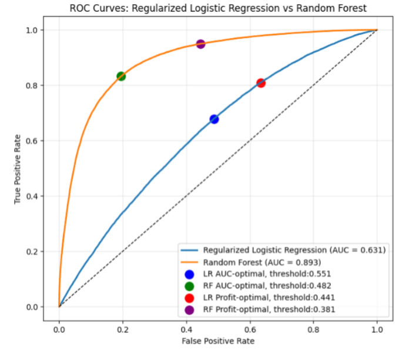

## Executive Summary
In this project, we selected and optimized a model to predict whether a car insurance quote becomes a bound policy based on 25 types of information. The dataset contains 101,891 real quote records from 2016 in Canada, mainly around Ontario. We evaluated two types of models, regularized logistic regression and random forest, and prepared the data so that the models could learn meaningful patterns. After removing unreasonable relationships among variables, transforming numerical values, and encoding categorical values, we obtained 95 useful features.
We then performed a two-step exhaustive search: the first to find the best model parameters, and the second to determine the best probability threshold for deciding whether a quote is bound or not. Using the selected models, we achieved estimated revenue improvements of 18 cents per person with Random forest and 12 cents per person with regularized logistic regression.

## 1. Data Preprocessing
We cleaned the dataset column by column to address missing values, correct inconsistencies, engineer features, and remove implausible observations. A concise summary of the main steps is provided below.

1. VEHICLE_YEAR: Converted vehicle year into vehicle age. Vehicles older than 1980 were flagged as “antique,” and vehicles reported as newer than the quote date were assigned age 0. The original VEHICLE_YEAR column was then removed.

2.	ANNUAL_KM and COMMUTE_DISTANCE: Exploration showed that some users had accidentally swapped these values, so cases where annual kilometres were smaller than commute distance were corrected. ANNUAL_KM was restricted to the realistic range of 500–20,000 km (values outside this range were capped and flagged). Missing ANNUAL_KM values were imputed using the median. Commute distances above 700 km were set to missing and then imputed using the median within ANNUAL_KM bins.

3.	VEHICLE_VALUE: Values below $500 were considered unrealistic, flagged, and set to missing. Users who did not report a value were also flagged. Missing values were imputed hierarchically: first using the median within matching year–make–model groups, then make–model groups, then vehicle-age groups, and finally the global median when no group-level information was available.

4.	YEAR_OF_BIRTH and YEARS_LICENSED: These variables were cleaned jointly to maintain consistency between age and driving experience. Impossible birth years (such as 9999, years after 2016, years before 1900, or years after 2000) were removed and used to calculate age. Licence years exceeding a feasible limit (age minus 16) or containing extreme values were set to missing. When age was known, missing licence years were imputed using the median of the relevant age bin, capped at realistic limits. If both variables were missing, a global median was used. Remaining missing birth years were inferred from licence-experience bins. After producing a clean and reliable age variable, YEAR_OF_BIRTH was removed, and missing-value flags were kept to retain information about originally invalid entries.

5.	VEHICLE_OWNERSHIP, VEHICLEUSE, GENDER and OCCUPATION: Missing values were replaced with "Unknown" / "Not Known", and rare categories were grouped into "Other".

6.	VEHICLEMAKE: Corrected spelling errors and standardized brand names (e.g., CHCVIOE ‚Üí CHEVROLET). Rare brands were grouped to reduce unique values to ~40.

7.	POSTAL CODE: Converted postal codes into geographic coordinates (latitude and longitude) using FSA (first three letters) to retain geographical variation as numeric values. Postal codes were chosen over area codes since area codes do not necessarily represent residential location.

8.	QUOTEDATE, AREA_CODE, TRACKING_SYSTEM, YEARS_AS_PRINCIPAL_DRIVER,  MARKING_SYSTEM, VEHICLEMODEL: Were removed due to irrelevance, large missing values, or excessive category variation.

### Encoding & Scaling
•	Categorical columns were one-hot encoded after reducing unique values.
•	Numeric columns were log-transformed to reduce skewness.
•	Standardization was applied only for logistic regression because of regularization.
After cleaning, we obtained 95 columns excluding IS_BOUND, consisting of 21 numeric and 74 encoded categorical columns.

## 2. Modelling 
### 2.1 Logistic Regression with Regularization
We selected logistic regression as the first model since it can handle mixed datasets with both categorical and numeric values, and because it is one of the primary methods covered in class. In addition, we combined regularization with it, expecting better performance and generalization.

To tune the model, we used GridSearchCV with a set of hyperparameters that control both the type and the strength of regularization. We explored two penalty types (L1 and L2) and searched over a wide range of regularization strengths using np.logspace(-3, 3, 20) to examine values from very weak to strong. For validation, we used 5-fold cross-validation and ROC-AUC as the scoring metric. Since our dataset is imbalanced, we set class_weight="balanced" inside the grid search.

As a result of training, the best model achieved an ROC-AUC of approximately 0.63, with the optimal configuration being L2 regularization and a regularization strength of 12.74. This suggests that a moderate level of shrinkage produced the best performance.

Next, we tuned the classification threshold. In this problem, the objective is to maximize advertising profit based on the following formula:

Profit = 5.5 × (True Positives) – 1 × (Predicted Positives)

Since different probability thresholds produce different trade-offs between true positives and false positives, selecting the threshold purely by ROC-AUC is not appropriate. After completing hyperparameter tuning, we ran a second cross-validation step to identify the threshold that maximizes expected profit by evaluating a dense grid of thresholds. As a result, we obtained the best profit-based threshold of approximately 0.38076.

### 2.2 Random Forest
We selected random forest as the second model because it is also covered in class and it can handle a wide variety of data types and nonlinear interactions. The basic tuning setup was the same as logistic regression: we used GridSearchCV with 5-fold cross-validation and ROC-AUC scoring.

Compared to logistic regression, random forest includes many more hyperparameters. Out of the 19 parameters available in RandomForestClassifier (scikit-learn), we selected three to tune using grid search: n_estimators, max_depth, and ccp_alpha. We chose these because we expected the number of trees (n_estimators), the maximum depth of trees (max_depth), and cost-complexity pruning (ccp_alpha) to have the strongest influence on performance. Other parameters were set to their default values either because they were already suitable or due to lower priority given the time constraint. Although we initially considered leaving class_weight as the default, we found that setting it to "balanced" reduced the false-negative rate for this imbalanced dataset.

Through grid search, we identified the best combination of hyperparameters as:

- n_estimators = 400
- max_depth = 20
- ccp_alpha = 0.0

Pruning (ccp_alpha) did not show a positive effect in our experiments, which aligns with the idea that deeper and more numerous trees generally improve performance. The number of trees performed best around 400, and max_depth values that were too high did not improve predictive power.
We then applied the same second threshold-tuning process as for logistic regression. As a result, we obtained the best profit-based threshold of approximately 0.44088.

## 3. Model Evaluation and Selection
## ROC-AUC:
The Random Forest model significantly outperformed the regularized Logistic Regression model, achieving an AUC of 0.893 compared to 0.631. This 26-percentage-point difference indicates that Random Forest was far more effective in this project. We believe this gap arises from Random Forest’s ability to capture nonlinear relationships and feature interactions, which appear to be present in this dataset. In contrast, the regularization constraints in Logistic Regression may have restricted the model, limiting its ability to learn more complex patterns.

  

Although Random Forest has drawbacks, such as higher computational cost and lower interpretability, it is well suited for classification problems where nonlinear effects play a major role.

Additionally, the optimal decision boundary based on the business objective showed that maximizing profit requires accepting a slightly higher false-positive rate than the threshold that optimizes the difference between TPR and FPR. In other words, to maximize revenue, the model must predict more “1” outcomes, even at the cost of a few additional false positives.

### LeaderBoard Scores:
As discussed above, our best logistic regression model was the L2-regularized model with a regularization parameter of 12.74, and our best random forest model used n_estimators = 400, max_depth = 20, and ccp_alpha = 0.0. In addition, we performed Stratified Cross Validation to determine the profit-maximizing decision thresholds and obtained thresholds of ≈0.38076 for logistic regression and ≈0.44088 for random forest. Using these settings, the results on the leaderboard were as follows:

| Criterion               | Priority    | Random Forest | Logistic Regression | Winner                          |
|------------------------|-------------|---------------|---------------------|----------------------------------|
| Revenue per Person     | Primary     | 18 cents      | 12 cents            | Random Forest (+50%)             |
| AUC                    | Secondary   | 0.893         | 0.631               | Random Forest (+26.2pp)          |
| False Positive Rate    | Tertiary    | 54%           | 65%                 | Random Forest (-11pp)            |
| False Negative Rate    | Quaternary  | 24%           | 20%                 | Logistic Regression (-4pp)       |

As stated in the table, we value the evaluation criteria in this priority order: Revenue per Person, AUC, False Positive Rate, and False Negative Rate. random forest outperformed logistic regression in most of the important measures. Therefore, for this project, we conclude that random forest is the recommended model for deployment.
