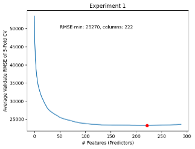
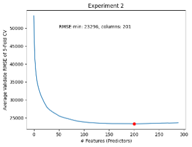
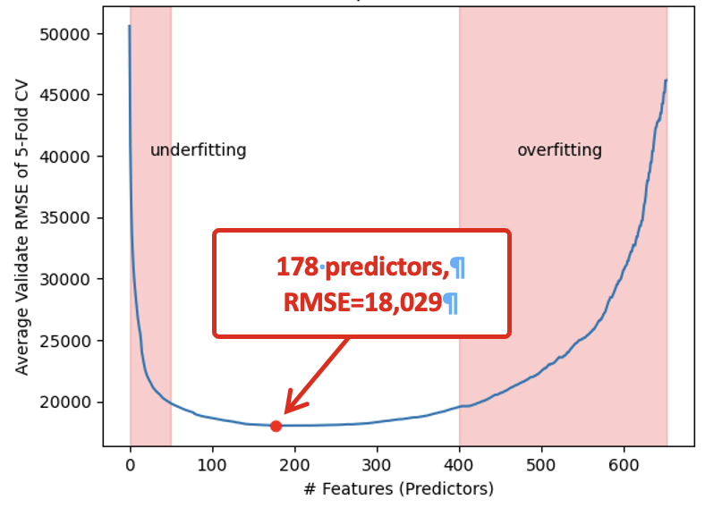
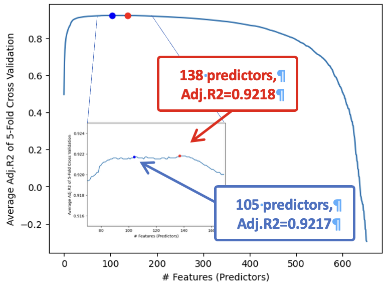

## Executive Summary
In this project, I developed a model to predict house prices using the Ames housing dataset. The dataset includes 80 types of information about each property, such as neighborhood, utilities, and lot size. Using the training data, I built a model to estimate sale prices and evaluated its accuracy with the test data. To prepare the data, I cleaned and organized the dataset by identifying data types, filling in missing values, and removing unsuitable records. After processing and converting categorical information, the total number of features expanded from 80 to 654. Through model selection and tuning, I determined that the best-performing model used 105 key factors, balancing accuracy and generalization. The final model achieved a testing score (Root Mean Squared Error) of 20,791 on the test data, demonstrating strong predictive performance.

## Data Pre-Processing
Data preprocessing was conducted in six steps:

   Step 1.   Identify whether each column is categorical or numerical.
   Step 2.   Verify that the data type of each column is appropriate.
   Step 3.   Handle missing records.
   Step 4.   Check whether all categorical columns follow data_description.txt.
   Step 5.   Detect outliers for numerical columns.
   Step 6.   Modify data.

Steps 1–3 were performed on the combined DataFrame of the training and testing datasets (1,000 and 446 records, respectively, with 81 shared features). For convenience, a temporary SalePrice column filled with zeros was added to the test data during preprocessing.

In Step 1, based on data_description.txt, I classified each column (except for “Id”) as categorical or numerical, identifying 60 categorical and 20 numerical columns. 

In Step 2, I confirmed that all data types were appropriate except for GarageYrBlt, which was loaded as float64. It was converted to int64 since it represents a categorical feature.

Step 3. Numerous missing records were found. For categorical columns, missing values should be replaced with “NA” or “None” according to their definitions. Most numerical columns could be filled with zeros. For LotFrontage, however, imputation rule LotFrontage=0.01×LotArea filled out the missing values. 

In Step 4, I verified the consistency of categorical variables against data_description.txt using helper functions. Most columns were valid, though I found minor typos in the documentation and corrected mistyped entries in Exterior2nd. The undefined category “Twnhs” in BldgType was retained since it appeared frequently (40+ records) and no suitable alternative existed.

In Step 5, viewing the distributions of numerical columns, I concluded in the outlier removal rules as follows: LotFrontage≤200,LotArea≤100000,BsmtFinSF1≤ 3000,BsmtFinSF2≤1200,TotalBsmtSF≤4000,1stFlrSF≤3200,GrLivArea≤4000,OpenPorchSF≤350,EnclosedPorch≤350,3SsnPorch≤400,and MiscVal≤4000.

In Step 6, data were modified according to the decisions above. However, imputation of LotFrontage and removal of outliers were deferred to the model tuning phase for comparison. 

A summary of all preprocessing actions was compiled in the “Data Information and Modification Decisions” table within the Python notebook.

## Modelling and Model Tuning
I selected multiple linear regression as the predictive model. Numerical features were used directly, and categorical features were converted into one-hot encoded vectors for compatibility.

To identify the optimal configuration, I applied forward selection with 5-fold cross-validation, using Root Mean Squared Error (RMSE) as the main evaluation metric and Adjusted R² to account for model complexity.

Then, I conducted three experiments to find better models:

   Experiment 1.  Forward selection with the current preprocessed data.
   Experiment 2.  Imputation of LotFrontage.
   Experiment 3.  Removal of outliers.

Experiments 1 and 2 yielded nearly identical results, so I retained the imputed LotFrontage for completeness. In Experiment 3, excluding outliers significantly improved model performance (Figures 1–3).

While RMSE indicated the optimal model contained about 178 predictors, Adjusted R² peaked at 0.9218 around 138 predictors and remained stable thereafter (Figure 4). Since simpler models generalize better, I selected the 105-predictor model as the final configuration, balancing performance and generality.

  

  <em>Figure 1. RMSE Changes During Forward Selection.</em>

  

  <em>Figure 2. RMSE Changes During Forward Selection.</em>

## Demonstration of Overfitting vs Underfitting
Using the forward selection method described in the previous section, both overfitting and underfitting behaviors were observed (Figure 3). For models with fewer than around 50 parameters (predictors), the cross-validation RMSE values were relatively high, indicating underfitting. As the number of parameters increased, the RMSE decreased and reached its minimum value of 18,029 at around 178 parameters. Beyond this point, the RMSE remained low but gradually began to rise again, suggesting that models with an excessive number of parameters, such as those exceeding 400, were overfitting to the training data.

  

  <em>Figure 3. RMSE Changes During Forward Selection.</em>

  

  <em>Figure 4. Adjusted R2 Changes During Forward Selection.</em>

## Final Model
For the final model, I use the 105 features identified during the forward selection process and recomputed the coefficients and intercept using the entire training dataset. Refer to the “Retrieve the Final Model” cell of the notebook for details on the final predictors, intercept, coefficients, and predictions. With this model, I got the score RMSE = 20,791 on the leaderboard.
